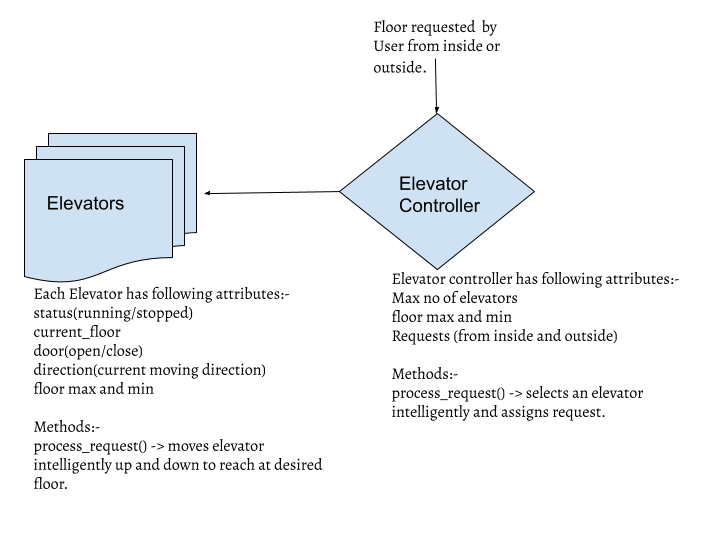

# Elevator
The Elevator system contains an elevator controller and ‘n’ number of elevators.



```
An Elevator can:-  
> Go up and down and track the current floor.
> Accept requests from the elevator controller from inside or outside of the elevator.
> Intelligently decides to move up or down, given a list of requested floors. 
The logic currently considers the first requested floor in the list.
> Provide its current status such as door open or close, current floor, is running or not.              
> Throws an error if the requested floor is less than min and greater than max.

## Elevator controller can:-
> Handles requests for ‘n’ number of elevators.
> Elevator controller accepts multiple requests and chooses the best elevator for the request.

Sample request:-
Two people requested to stop at 2 and 3
Elevator-1 current_floor = 0

Output returned is:-
[UP_1, UP_1, UP_1, OPEN_DOOR, CLOSE_DOOR]
[UP_1, OPEN_DOOR, CLOSE_DOOR]

```

How to Run:
```
1) Create and activate a python3 virtualenv.(Optional)
    python3 -m venv venv
    source venv/bin/activate
2) Download code from git rep.
   Go to /Elevator folder and execute unit test cases for elevator and elevator controller. 
    a) python -m unittest elevator_controller_test 
    b) python -m unittest elevator_test 
Change inputs as required in the testcases.
```

Future work:
```
1) We need to enhance the system to use better cost functions. Currently it determines the cost of moving an elevator up and down  by considering the first requested floor only.
2) Need to improve upon error handling.
3) Consider using the moving elevator to accept the incoming request. Currently the elevator accepts new requests only when it is not running.
4) Expose elevator API and have a docker image for the solution. 
```
